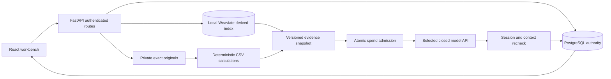

# Application architecture

Newton owns investigation context, evidence and corrections. The application uses
ordinary Python services. Pydantic AI, MCP and Jev are evaluated separately and
are not runtime requirements.

## Ownership and data

Each company belongs to one account. Every machine, source, preview, measurement
and conversation resolves that ownership from persisted SQL state. Unknown and
foreign identifiers return 404. The application enforces this boundary; it does
not use SQL row-level security or shared-company roles.

Weaviate is derived data. Retrieval starts with the authorized company and machine,
then checks returned source, version and page identities against SQL. Text excerpts
are reconstructed from checked SQL pages. Original files receive a SHA-256 identity
and a generated private storage path. Filenames never become paths.

PDF text remains literal, page previews are bounded PNGs, and a missing extraction
remains missing. CSV mappings record the chosen columns, unit and timezone. Newton
does not rescale values, interpolate gaps or forecast. An invalid row rejects the
series. Charts return the first 5,000 points in file order; summaries cover every
valid row and label truncation. The source inspector provides chart inspection.

Deleting a source first removes its derived index entries under a per-machine lock.
If that fails, Newton keeps the source. Historical answer snapshots remain visible
and can become superseded; this is not a complete erasure workflow.

## Evidence and model calls

Text retrieval uses named single vectors, OpenAI embeddings and Weaviate hybrid
search. Visual retrieval uses a separate page collection and an optional pinned
ColQwen encoder. SQL validates every candidate before Newton renders an original.
The evidence record identifies derived representations by model/revision and
rendered-page hash.

Models receive deterministic CSV summaries, non-PDF text and source-mapped native
PDF excerpts. Native PDF input is limited to nine excerpts, 27 pages and 12 MiB per
request. Company context, selected source content, questions and recent conversation
are sent to the selected provider for inference. A local visual index does not make
model inference local.

## Investigations and corrections

A question checks the submitted context version, rejects an overlapping run and
stores the question. Newton synchronizes the index, retrieves evidence, adds CSV
summaries, reserves budget and makes one provider request. It rechecks session,
scope, machine context and run identity before returning a result. A result based
on older context is stored as superseded. Revoked sessions receive no answer.

Source uploads, source revisions, mapping changes, deletions and machine-context
changes advance the machine version. Conversation corrections advance the scope
revision and retain their text. Historical answers preserve their original evidence
snapshot. Evidence records retain the source and derivation format.

The active-run lease expires after ten minutes. The application handles answers as
synchronous local HTTP requests; it has no durable queue or provider-cancellation
guarantee. Ambiguous provider spending remains reserved.

## Autonomous onboarding

An onboarding run advances SQL state through an in-process background worker with
durable checkpoints. Its stages profile uploaded originals, research public company
information through cited sources, prepare validated evidence, and index sources.
The Gemini Interactions loop uses `store=false`, a maximum of forty turns, signed
step history and rebuilt context from validated SQL state when the input reaches
its bound. The worker validates tool arguments against declared Pydantic schemas.

Naive timestamps keep `source_local` semantics. Start-up applies `migrations.py`
before `create_all` and marks interrupted runs as paused.

## Source layout

| Modules | Responsibility |
| --- | --- |
| `auth.py`, `security.py` | Sessions, password hashes, ownership |
| `companies.py`, `models.py`, `db.py` | Company and machine SQL state |
| `sources.py`, `documents.py`, `_storage.py` | Originals and source inspection |
| `measurements.py` | CSV validation and calculations |
| `retrieval.py`, `visual_retrieval.py`, `visual_encoder.py` | Scoped text/page indexing and source provenance |
| `evidence.py` | Readiness, snapshots and evidence prompts |
| `investigations.py`, `investigation_run.py` | Conversations, corrections and run admission |
| `providers.py`, `provider_images.py`, `budget.py` | Provider calls and cumulative spending |
| `onboarding*.py`, `intake_*.py`, `company_research.py` | Onboarding state, profiling, research and indexing |
| `migrations.py`, `index_lock.py`, `source_scope.py` | Source migrations, locks and company-library scope |
| `web/src/features` | Account, source and investigation journeys |

Python modules live in `server/newton`. The local implementation has not
established industrial diagnostic accuracy, general model quality or production
security.
